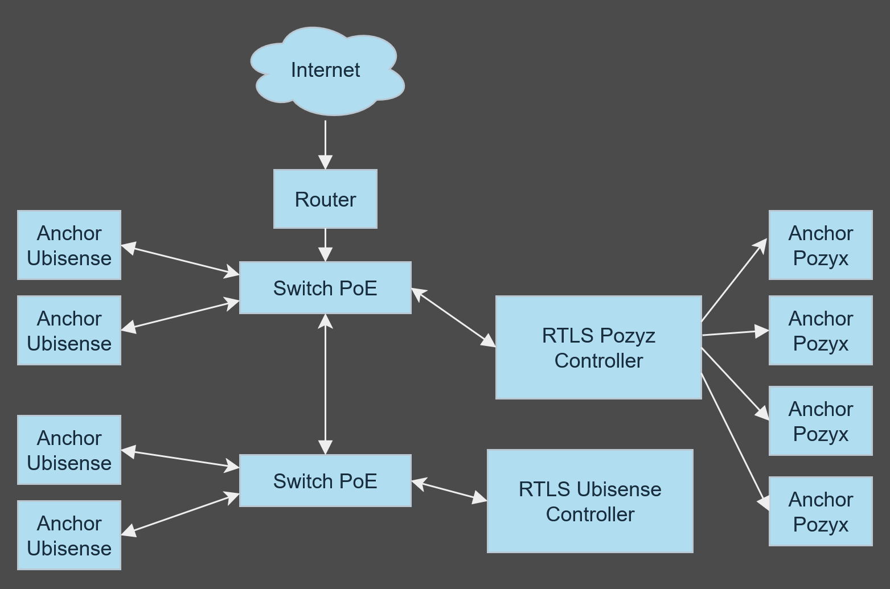

# UWB-RTLS-Corridor-Demo

Implementacja korytarzowego pola testowego RTLS opartego na UWB (system Ubisense).
Repo służy do wersjonowania konfiguracji sieci, skryptów kalibracyjnych
i narzędzi analitycznych (Python/Jupyter).

  

## Topologia sieci RTLS (Ubisense + Pozyx)

Poniższy schemat przedstawia fizyczną topologię sieci, w której równolegle działają dwa systemy lokalizacji czasu rzeczywistego: Ubisense oraz Pozyx. Oba systemy pracują we wspólnej infrastrukturze Ethernet zasilanej przez przełączniki PoE.

### Opis struktury

Router z dostępem do Internetu połączony jest z głównym switchem PoE. Z tego switcha wychodzą trzy połączenia:

- do kontrolera RTLS Pozyx
- do dwóch anchorów Ubisense
- do drugiego switcha PoE (kaskadowo)

Z drugiego switcha PoE wychodzą połączenia:

- do kontrolera RTLS Ubisense
- do dwóch kolejnych anchorów Ubisense

Kontroler Pozyx jest bezpośrednio połączony z czterema anchorami Pozyx, które są zasilane i komunikują się przez Ethernet.

### Lista połączeń

Router → Switch PoE #1  
Switch PoE #1 → RTLS Pozyx Controller  
Switch PoE #1 → Anchor Ubisense (x2)  
Switch PoE #1 → Switch PoE #2  
Switch PoE #2 → RTLS Ubisense Controller  
Switch PoE #2 → Anchor Ubisense (x2)  
RTLS Pozyx Controller → Anchor Pozyx (x4)

### Uwagi

Topologia umożliwia niezależną konfigurację każdego z systemów, przy jednoczesnym współdzieleniu infrastruktury zasilająco-transmisyjnej. Układ został dobrany tak, aby możliwa była szybka rekonfiguracja lub odseparowanie systemów w warstwie logicznej (np. VLAN, overlay, bridge).

