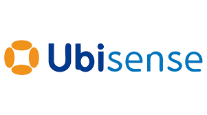
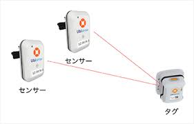
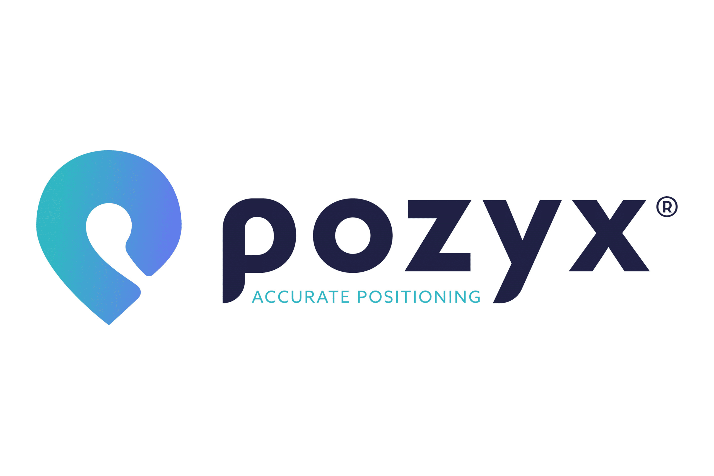
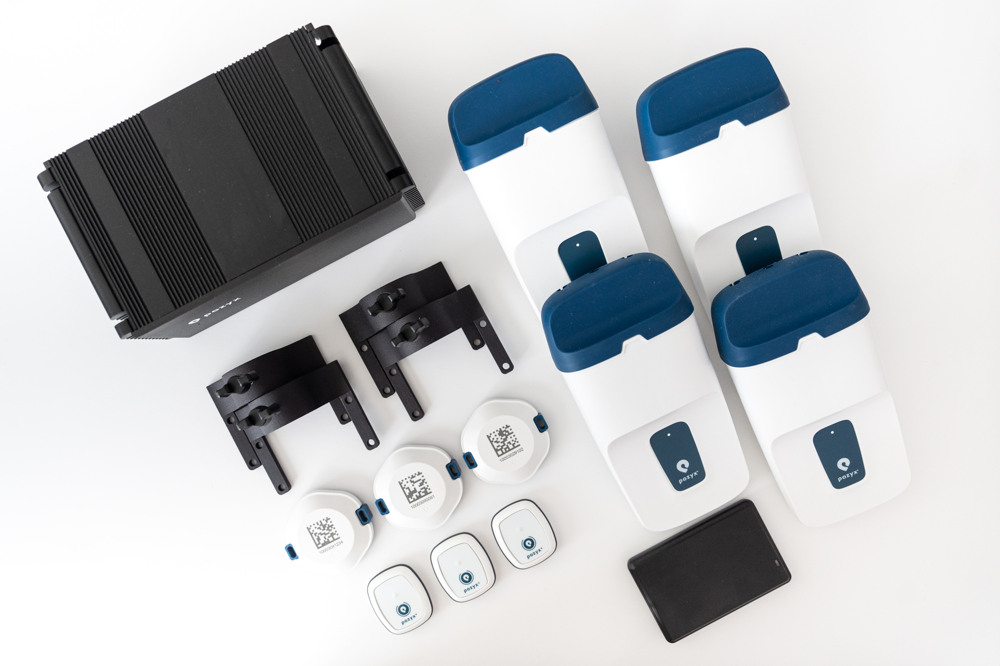
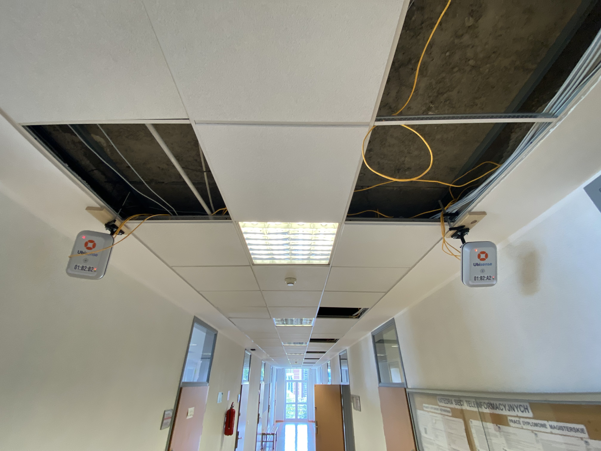
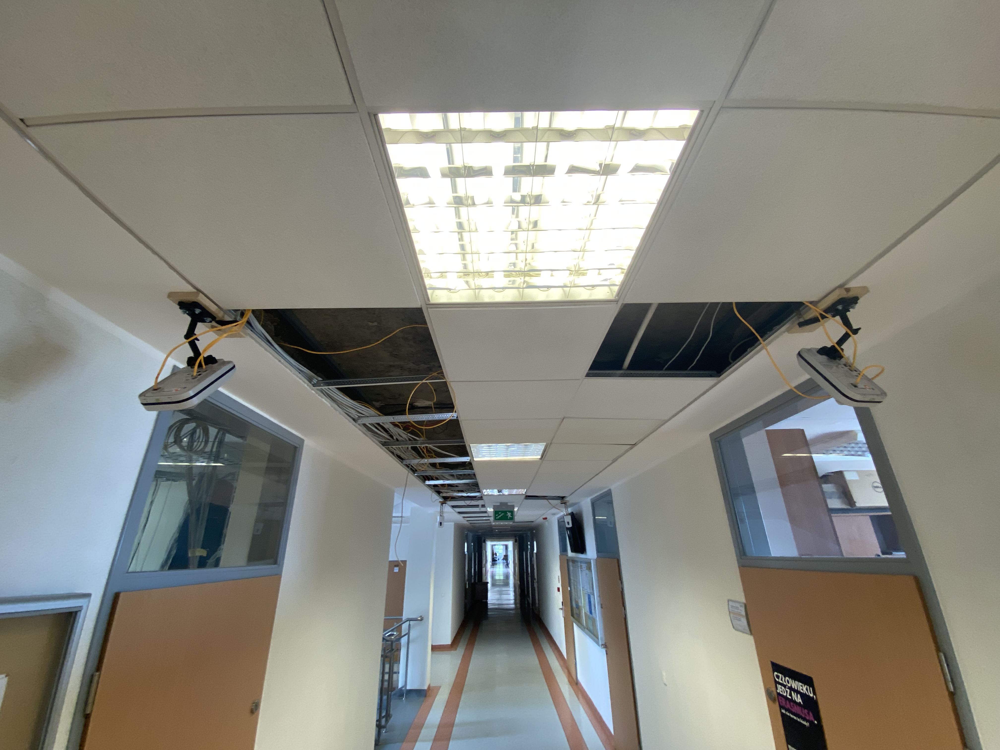
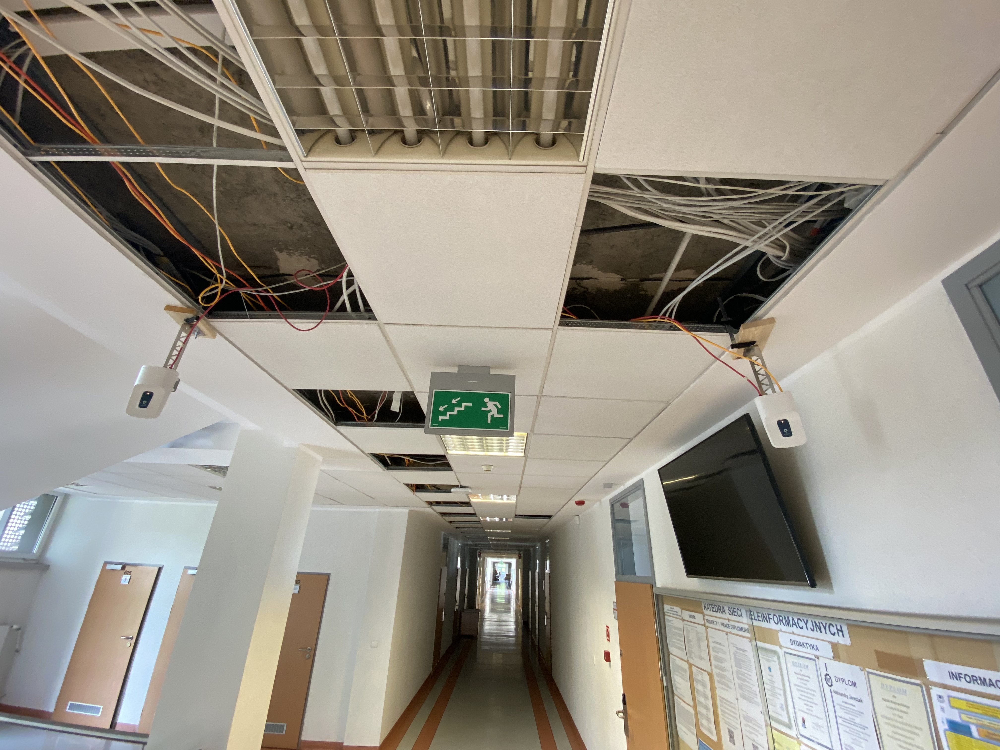
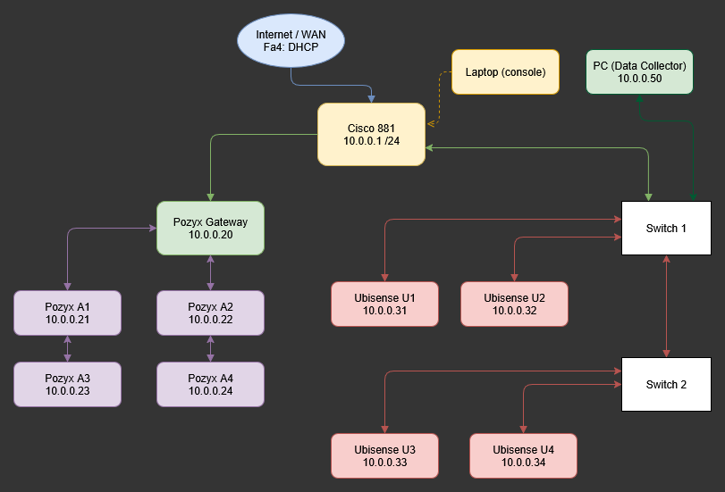
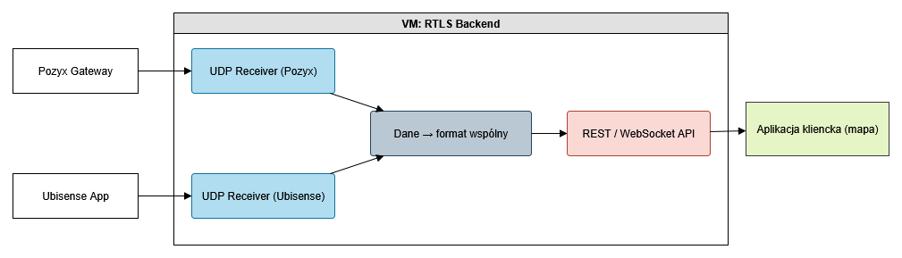
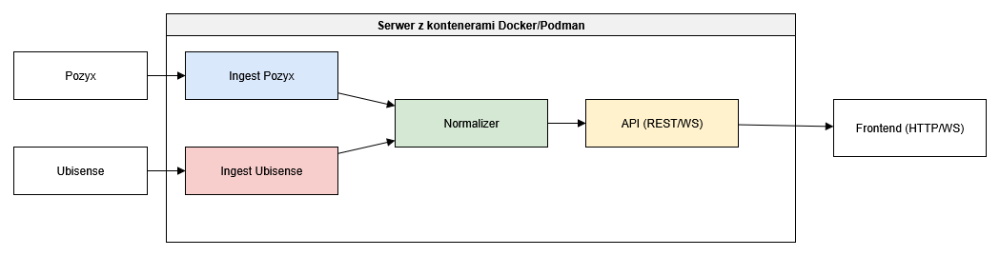

Założenia systemu RTLS

System został zaprojektowany jako modularna architektura czasu rzeczywistego do odbioru i integracji danych z różnych technologii lokalizacji. Główne założenia:

- Obsługa wielu źródeł danych lokalizacyjnych przez UDP (Pozyx, Ubisense)
- Przetwarzanie danych na serwerze (VM lub kontenery)
- Ujednolicenie formatu wiadomości do modelu `{id, x, y, z, t}`
- Dostęp do danych przez REST API oraz WebSocket
- Zewnętrzny frontend (klient HTTP), niezależny od backendu
- Możliwość integracji z systemami MES / ERP / BI

Technologia UWB i systemy RTLS

### Czym jest UWB?

**Ultra-Wideband (UWB)** to technologia bezprzewodowa umożliwiająca bardzo precyzyjne pomiary odległości oraz pozycjonowanie w czasie rzeczywistym (RTLS). Działa w paśmie od 3,1 do 10,6 GHz i pozwala na dokładność rzędu kilku centymetrów. Dzięki bardzo krótkim impulsom UWB nie koliduje z typowymi sieciami Wi-Fi i Bluetooth i jest odporna na wielodrogowość (multipath).

### Podejścia lokalizacyjne: TDoA i AoA

**TDoA (Time Difference of Arrival)**  
Pozycja obliczana jest na podstawie różnicy czasów przylotu sygnałów do anchorów. Wymaga precyzyjnej synchronizacji czasu między urządzeniami, co realizowane jest zwykle przez sieć Ethernet i protokoły takie jak PTP. Metoda ta dobrze sprawdza się w otwartych przestrzeniach z dużą liczbą anchorów.

**AoA (Angle of Arrival)**  
Pozycja określana jest przez pomiar kąta, pod jakim sygnał dotarł do anteny odbiorczej. Systemy AoA nie wymagają synchronizacji czasowej między urządzeniami, ale opierają się na antenach kierunkowych i zaawansowanych algorytmach przetwarzania sygnału. Technologia ta sprawdza się w elastycznych, przemysłowych instalacjach.

## Systemy Ubisense i Pozyx

### Ubisense

Ubisense to dojrzały, przemysłowy system lokalizacji oparty na UWB i TDoA. Umożliwia precyzyjne śledzenie obiektów w czasie rzeczywistym w środowiskach przemysłowych i magazynowych. Komunikacja z systemem odbywa się poprzez multicast UDP z użyciem protokołu OTW-40.

 

  

### Pozyx

Pozyx to nowoczesny, modułowy system UWB RTLS oparty na metodzie AoA. Ułatwia szybkie wdrożenia w przemyśle, wspiera protokół UDP i umożliwia bezpośrednie połączenie z gatewayem, bez potrzeby centralnego serwera. Anchory Pozyx mogą być zasilane przez PoE i sterowane zdalnie z poziomu interfejsu webowego.

 

 

### Sprzęt – zamontowane urządzenia

Poniżej zdjęcia z wdrożenia fizycznego systemu:

#### Ubisense: kontrolery z trzema portami Ethernet do synchronizacji

Każdy z kontrolerów Ubisense posiada:
- dedykowane porty dla synchronizacji między anchorami (czas i pozycja),
- osobne porty Ethernet do zarządzania i zasilania (PoE).
- 

 

#### Pozyx: anchor z magistralą Ethernet (zasilanie + komunikacja)

System Pozyx korzysta z uproszczonej architektury:
- każdy anchor posiada port Ethernet z obsługą PoE,
- synchronizacja czasowa odbywa się przez sieć (PTP),
- dane UDP są przesyłane bezpośrednio z gatewaya Pozyx.

## Topologia sieci RTLS (Ubisense + Pozyx)

W tym wariancie backend RTLS działa wewnątrz pojedynczej maszyny wirtualnej. Do niej przesyłane są wiadomości UDP z zewnętrznych systemów lokalizacji (Pozyx oraz Ubisense). Każdy z protokołów ma osobny odbiornik, który parsuje wiadomości i przekazuje je do wspólnego przetwarzania. Wynik udostępniany jest poprzez interfejs API (REST lub WebSocket), a wizualizacja odbywa się po stronie klienta.

### Kluczowe elementy:
- `Pozyx Gateway` i `Ubisense App` – wysyłają dane lokalizacyjne jako wiadomości UDP
- `UDP Receiver (Pozyx)` – parser wiadomości UDP specyficznych dla Pozyx
- `UDP Receiver (Ubisense)` – parser wiadomości w formacie OTW-40
- `Dane → format wspólny` – warstwa normalizacji danych `{id, x, y, z, t}`
- `REST / WebSocket API` – udostępnia dane w czasie rzeczywistym
- `Aplikacja kliencka (mapa)` – frontend działa poza wirtualką i wizualizuje lokalizację

System może być uruchomiony na dowolnym hypervisorze (np. VirtualBox, Proxmox, KVM), a komunikacja UDP odbywa się w obrębie lokalnej podsieci.

Kontroler Pozyx jest bezpośrednio połączony z czterema anchorami Pozyx, które są zasilane i komunikują się przez Ethernet.

### Lista połączeń

Router → Switch PoE #1  
Switch PoE #1 → RTLS Pozyx Controller  
Switch PoE #1 → Anchor Ubisense (x2)  
Switch PoE #1 → Switch PoE #2  
Switch PoE #2 → RTLS Ubisense Controller  
Switch PoE #2 → Anchor Ubisense (x2)  
RTLS Pozyx Controller → Anchor Pozyx (x4)

## Możliwe rozwiązania aplikacji

Dane z systemów RTLS (Ubisense oraz Pozyx) mogą być odbierane i przetwarzane przez wspólną aplikację zbierającą. Głównym celem jest unifikacja danych lokalizacyjnych przesyłanych przez UDP i udostępnienie ich w czasie rzeczywistym do dalszych modułów (np. API, wizualizacja, system MES).

Poniżej przedstawiono dwa niezależne sposoby realizacji aplikacji – w oparciu o wirtualne maszyny oraz o kontenery z interpreterem Pythona.

### Rozwiązanie 1: UDP na wirtualnych maszynach

Każdy komponent aplikacji działa na oddzielnej maszynie wirtualnej (np. VirtualBox, Proxmox, KVM). Maszyny są połączone wewnętrzną siecią bridge, a połączenia UDP realizowane są między adresami prywatnymi.

### Kluczowe elementy:
- `Pozyx Gateway` i `Ubisense App` – wysyłają dane lokalizacyjne jako wiadomości UDP
- `UDP Receiver (Pozyx)` – parser wiadomości UDP specyficznych dla Pozyx
- `UDP Receiver (Ubisense)` – parser wiadomości w formacie OTW-40
- `Dane → format wspólny` – warstwa normalizacji danych `{id, x, y, z, t}`
- `REST / WebSocket API` – udostępnia dane w czasie rzeczywistym
- `Aplikacja kliencka (mapa)` – frontend działa poza wirtualką i wizualizuje lokalizację

System może być uruchomiony na dowolnym hypervisorze (np. VirtualBox, Proxmox, KVM), a komunikacja UDP odbywa się w obrębie lokalnej podsieci.

### Rozwiązanie 2: Przetwarzanie UDP w kontenerach z frontendem poza serwerem

Poniższy diagram przedstawia sposób odbioru danych lokalizacyjnych z sieci UDP w kontenerach Docker/Podman oraz ich ekspozycję do zewnętrznych aplikacji. Frontend działa poza hostem kontenerowym i łączy się z API udostępnianym przez backend.

Schemat zakłada:
- dwa źródła danych UDP (wcześniej opisane),
- kontenery: ingest, normalizer, API,
- frontend działający niezależnie (np. przeglądarka, MES, dashboard).

Architektura jest w pełni modularna, gotowa do wdrożenia w Docker Compose lub Podman Pod. Komunikacja wewnętrzna kontenerów może opierać się o kolejki asynchroniczne (np. asyncio), sockety lub lokalny TCP. API udostępnia dane lokalizacyjne w formacie ujednoliconym `{id, x, y, z, t}`.

